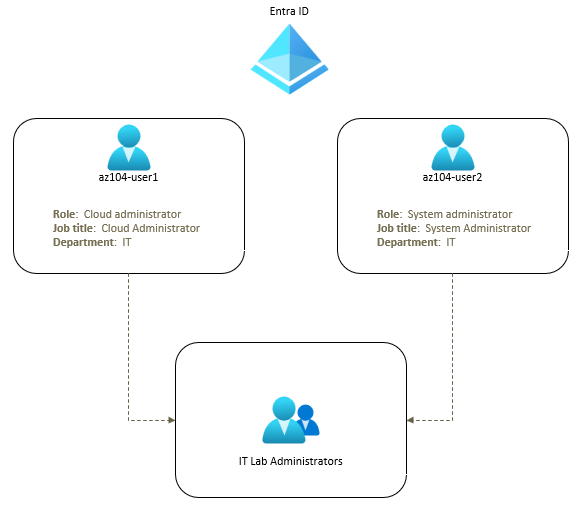
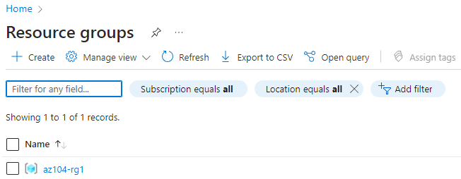

---
lab:
    title: 'Lab 01: Manage Microsoft Entra ID Identities'
    module: 'Administer Identity'
---

# Lab 01 - Manage Microsoft Entra ID Identities

## Lab scenario

Your organization is building out a new lab environment for pre-production testing of apps and services.  A few engineers are being hired to manage the lab environment, including the virtual machines. In order to allow the engineers to authenticate by using Microsoft Entra ID, you have been tasked with provisioning users and group accounts. To minimize administrative overhead, membership of the groups should be updated automatically based on job titles. You also need to know how to delete users to prevent access after an engineer leaves your organization.

**Note:** An **[interactive lab simulation](https://mslabs.cloudguides.com/guides/AZ-104%20Exam%20Guide%20-%20Microsoft%20Azure%20Administrator%20Exercise%201)** is available that allows you to click through this lab at your own pace. You may find slight differences between the interactive simulation and the hosted lab, but the core concepts and ideas being demonstrated are the same.

## Lab requirements

This lab requires access to the Azure portal and the ability to create group accounts. 

## Estimated timing: 30 minutes

## Tasks

In this lab, you will:

+ Task 1: Familiarize yourself with the Azure portal 
+ Task 2: Create a resource group
+ Task 3: Familiarize yourself with user accounts and group membership
+ Task 4: Create a resource group

## Architecture diagram

## Task 1: Familiarize yourself with the Azure portal 

In this task, you familiarize yourself with the Azure portal. The Azure portal is a web-based, unified console that provides an alternative to command-line tools. With the Azure portal, you can manage your Azure subscription using a graphical user interface. You can build, manage, and monitor everything from simple web apps to complex cloud deployments in the portal. 

1. Sign in to the [Azure portal](https://portal.azure.com). 

1. Begin your tour of the Azure portal, by selecting the top left menu icon. 

   + Select **Home** to view recent services and resources. You can also create favorites. 
   + Select **Dashboard** for a customized view. [Dashboards](https://learn.microsoft.com/zure/azure-portal/azure-portal-dashboards) are a focused and organized view of your cloud resources in the Azure portal. Use dashboards as a workspace where you can monitor resources and quickly launch tasks for day-to-day operations.
   + Select **All services** to view a categorized list of Azure services.

1. You may find it quicker to **Search resources, services, and docs** using the search box in the top center of the portal. The search box provides autocomplete and suggestions for services or resources. For example, try `virt` and notice the suggested matches.

1. On the right side of the top menu bar, select the **Settings** icon. Settings lets you customize the portal appearance, language and region.

1. Lastly, in the top right corner is your user account information.
   
## Task 2: Create a new resource group

In this task, you will create a new resource group. A resource group is a grouping of related resources (such as all the resources for a project, a department, or an application). For each lab in this course you will create a resource group. 
    
1. In the Azure portal, search for and select **Resource groups**.
   
1. On the **Resource groups** blade, click **+ Create**, and specify the following setting:

    | Setting | Value |
    | --- | --- |
    | Subscription name | the name of your Azure subscription |
    | Resource group name | `az104-rg1` |
    | Location | **East US** |
    
1. Click **Review + create** and then click **Create**.

    >**Note**: Wait for the resource group to deploy. Use the **Notification** icon (top right) to track progress of the deployment.

1. Back on the **Resource groups** blade, refresh the page and verify your new resource group appears in the list of resource groups.

## Task 2: Familiarize yourself with user accounts and group membership. 

In this task, you will familiarize yourself with user account and profiles. You also view group membership.

1. In the Azure portal, search for and select **Microsoft Entra ID**.

1. In the **Manage** section, select the **Users** blade. 

1. Select **New user** from the top menu. Notice the selections for **Create new user** and **Invite external user**. We will not be creating new users in this lab.

1. **Search** for and select your user account.

1. Select the **Properties** tab and review all the profile information that can be provided for a user account. 

1. Review the options available in the **Manage** section and note that you can identify the roles assigned to the user account as well as the user account's permissions to Azure resources.

1. Select **Groups** to view your group memberships.

## Task 3: Create groups with assigned and dynamic membership

In this task, you will create a group. Groups are used for user accounts or devices. Some groups have members that are statically assigned. Some groups have members that are dynamically assigned. Dynamic groups update automatically based on the properties of user accounts or devices. Static groups require more administrative overhead (administrators have to add and remove members manually).

1. In the Azure portal, navigate to the Microsoft Entra ID tenant blade and click **Groups**.

1. Use the **+ New group** button to create a new group with the following settings:

    | Setting | Value |
    | --- | --- |
    | Group type | **Security** |
    | Group name | `IT Lab Administrators` |
    | Group description | `Administrators that manage the IT lab` |
    | Membership type | **Assigned** |

    >**Note**: Your **Membership type** drop-down list might be grayed out. This is where you can switch from an assigned group to a dynamic group if you have an Entra ID Premium P1 or P2 license.

    

   
1. Click **No members selected**.

1. From the **Add members** blade, search for **IT Cloud Administrators**, click the checkbox to the left of it. Next, search for **IT System Administrators** groups, click the checkbox to the left of it and then click **Select**. Back on the **New Group** blade, click **Create**.

    

1. Create a new user with the following settings (leave others with their defaults):

    | Setting | Value |
    | --- | --- |
    | User principal name | `az104-user1` |
    | Display name | `az104-user1` |
    | Auto-generate password | de-select |
    | Initial password | **Provide a secure password** |
    | Job title (Properties tab) | `Cloud Administrator` |
    | Department (Properties tab) | `IT` |
    | Usage location (Properties tab) | **United States** |

    >**Note**: **Copy to clipboard** the full **User Principal Name** (user name plus domain). You will need it later in this task.

    

1. In the **Manage** section, click **Assigned roles**, then click **+ Add assignment** button and assign the **User administrator** role to **az104-user1**.

    >**Note**: You also have the option of assigning roles when provisioning a new user.

1. Open an **InPrivate** browser window and sign in to the [Azure portal](https://portal.azure.com) using the newly created user account. When prompted to update the password, change the password to a secure password of your choosing. 

    >**Note**: Rather than typing the user name (including the domain name), you can paste the content of Clipboard.

1. In the **InPrivate** browser window, in the Azure portal, search for and select **Microsoft Entra ID**.

    >**Note**: While this user account can access the tenant, it does not have any access to Azure resources. This is expected, since such access would need to be granted explicitly by using Azure Role-Based Access Control. 

1. In the **InPrivate** browser window, on the Microsoft Entra ID blade, scroll down to the **Manage** section, click **User settings**, and note that you do not have permissions to modify any configuration options.

1. In the **InPrivate** browser window, on the Microsoft Entra ID blade, in the **Manage** section, click **Users**, and then click **+ New user**.

1. Create a new user with the following settings (leave others with their defaults):

    | Setting | Value |
    | --- | --- |
    | User principal name | `az104-user2` |
    | Display name | `az104-user2` |
    | Auto-generate password | de-select  |
    | Initial password | **Provide a secure password** |
    | Job title | `System Administrator` |
    | Department | `IT` |
    | Usage location | **United States** |
    
1. Sign out as the az104-user1 user from the Azure portal and close the InPrivate browser window.

#### Review

Congratulations! You created and configured user accounts, created a group, created a resource group, assigned a role to a user, and deleted a user account.
